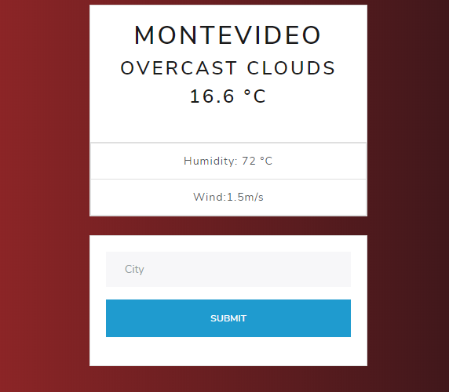

# weather-app
In this project I  create an app able to search for the weather in specific location and toggle displaying the data in Fahrenheit or Celsius.

##Live version:

[Live Demo](https://github.com/gagc056/weather-app)

This are some of the instructions that on setting up your project locally. To get a local copy up and run this:

Prerequisites

npm

npm install npm@latest -g

Installation

Get a free API Key at https://openweathermap.org/

Clone the repo

git clone https://github.com/gagc056/weather-app

Install NPM packages

npm install

Enter your API
const API_KEY = 'ENTER YOUR API';

run npm run start

stack used:

-HTML

-CSS

-npm

-javascript

##Authors
-Github: https://github.com/gagc056

- Linkedin:https://www.linkedin.com/in/gastoncosta/

🤝 Contributing
Contributions, issues and feature requests are welcome!

Feel free to check the issues page.

Show your support
Give a ⭐️ if you like this project!